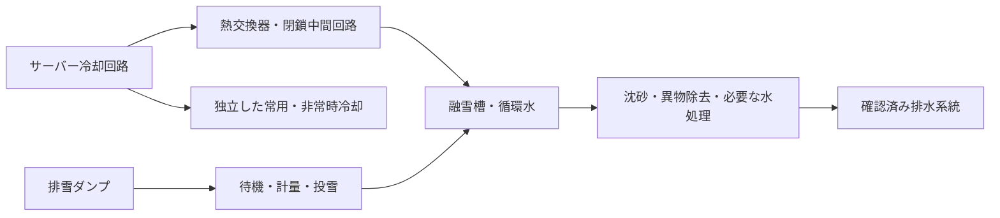

# 札幌の除排雪経路とデータセンター排熱利用の設計

調査・取得日：2026年9月8日。事実・計算結果・設計上の仮定・未確認事項を分離した初期設計です。

## 1. 設計の結論

**除雪経路はグラフ理論で改善できる。ただし「全道路を一度通る」だけでは実際の除雪完了にならない。** 作業対象を方向・車線・幅・工種・必要回数に分解し、車庫、機種、乗務員、期限を制約にする。かき分け除雪と、積込・運搬排雪は別の経路問題として扱い、後者を融雪施設の配置・能力と接続する。

データセンター（DC）の排熱利用は熱収支上成立する可能性がある。最初の検討は**新川・厚別・東部の融雪施設周辺での、既存処理への追加熱供給**とする。建設用地や受電余力を確認できていないため、現段階ではDCの建設区画・規模・採算は確定できない。既存の下水熱を使う施設にDCを足しても、投雪や排水が限界なら処理量は増えない。

今回作成したものはデータ台帳・地図・動く経路計算・熱収支計算・市全域への拡張設計。市全域の実配車、全業者の実稼働台数、土地取得可能性の調査は未完了である。

## 2. 取得した札幌のデータ

| データ | 今回の取得内容 | 利用上の区別 |
|---|---|---|
| 協会の会員一覧 | 所在地209掲載件 | 法人数の全数ではなく営業所等も含む。保有数・出動車庫ではない |
| 会社公表の機械 | 4社の機種別保有数 | 当日利用数、拠点別内訳、車検・装備・乗務員は未確認 |
| 市貸与機械 | 2026年度・23地区の9機種 | 参考・予定資料。企業保有数ではない |
| 最低必要台数 | 2026年度・23地区の5区分 | 市貸与車を含む。貸与数との二重加算禁止 |
| 融雪施設 | 既存槽・管・投雪口の位置と能力、東部の計画 | 施設稼働・受入余力の時系列は未取得 |
| 降雪・積雪 | 2025/11/1〜2026/4/10、13地点 | 朝9時までの24時間降雪。市資料の参考値期間を含む |
| 道路 | OSM矩形内の車道1,343方向区間 | 市公式除雪路線ではない。対象種別等のフィルター後 |

取得URL・日時・SHA-256を `data/sources.json`、道路を `data/roads_source.json`、住所検索を `data/raw/geocoding.json` に保存した。元PDFが画像だけのため、機械表は画像で確認して転記し、列合計を検算した。

### 2.1 業者と機械

| 業者 | 地図に載せた公開所在地 | 主な公表台数 |
|---|---|---|
| 東洋ロードメンテナンス | 西区発寒13条14丁目1080番地29・発寒事業所 | グレーダ3、大型ロータリ2、ショベルローダ7、4tダンプ2 |
| 鹿島舗道工業 | 南区中の沢1775-5・資材センター／モータープール | グレーダー3、大型ロータリー1、タイヤショベル10、小型ショベル3、4tダンプ9 |
| サツイチ | 北区新川7条16丁目708番地3・本社／土木事業部 | 10tダンプ23、タイヤショベル4 |
| KRS | 白石区川下577番地87号・工事事務所 | 11tダンプ4、4tダンプ4、2tダンプ1、タイヤショベル計7 |

出典：[東洋ロードメンテナンス](https://toyoroad.co.jp/about/)、[鹿島舗道工業](https://kashimahodou.jp/)、[サツイチの機械](https://www.satsuichi.co.jp/engineering/)・[所在地](https://www.satsuichi.co.jp/about/)、[KRS](https://www.krs-sapporo.co.jp/business/)。所在地と台数はそれぞれの公開情報で、**その所在地に全車が配備されているとは確認していない**。KRSの住所は原文の「北海道白石区」を札幌市白石区として正規化した。

[札幌市除雪事業協会の掲載一覧](https://sapporo-josetsu.jp/member.html)を母集団にして、機械数未確認の企業も保持した。住所を持つことと、車庫入口まで特定できることは別。初期地図は国土地理院住所検索の地番・丁目等の代表点である。

### 2.2 2026年度の市貸与計画

| 機種 | 台数 |
|---|---:|
| 除雪グレーダ | 139 |
| 除雪トラック | 10 |
| タイヤショベル | 23 |
| 大形ロータリ | 21 |
| 小形ロータリ40PS | 5 |
| 小形ロータリ80〜130PS | 199 |
| 散布車4m³ | 24 |
| 散布車2m³ | 3 |
| 歩道散布車 | 10 |
| 合計 | 434 |

主要機械の最低必要台数はグレーダ系223、タイヤショベル534、小形ロータリ209、大形ロータリ100、10tダンプ1,480。これは機種・工種ごとの確保条件で、同時稼働する除雪車台数ではない。市貸与車を含むため434を加えてはいけない。[2026年度入札予定の説明](https://www.city.sapporo.jp/kensetsu/yuki/jigyosha/nyusatsu.html)、[資料4](https://www.city.sapporo.jp/kensetsu/yuki/jigyosha/documents/4_taiyosyadaisu.pdf)、[資料5](https://www.city.sapporo.jp/kensetsu/yuki/jigyosha/documents/5_saiteidaisu.pdf)。

### 2.3 実降雪によるシナリオの設定

取り込んだ公表日量を集計すると、西区（西野）は累計581cm、最大日降雪30cm、西区（平和）は719cm、最大36cmだった。中央区は508cm・最大37cm、北区（太平）は535cm・最大49cm。市域の一律降雪量にせず、地点差と大雪時の同時発生を扱う。[札幌市の観測データ](https://www.city.sapporo.jp/kensetsu/yuki/weather-data.html)。

この日量は実際の夜間作業開始時の積雪量ではない。10cm超の日数を出動回数へ置き換えない。2025/11/1〜13、および白石区2026/3/9〜25には参考値が含まれる。現モデルは天候を説明用に取り込んだ段階で、観測値を経路速度へ自動変換する係数は未校正。

運用モデルでは通常・大雪・連続降雪の各シナリオを、実測時系列から作る。初期の10cm、20cm、40cmはシナリオ入力値とし、1年の観測値だけで再現期間を推定しない。

## 3. 全道路作業を保証する経路モデル

### 3.1 何を一度通るか

「全て」は責任範囲内でその出動に作業が必要な道路タスク集合を意味する。国道・道道・市道・私道、歩道と車道、未供用道路を別管理し、対象外は理由を付けて残す。[札幌市の除雪対象道路の説明](https://www.city.sapporo.jp/kensetsu/yuki/question/01/index.html)。

- ノード：交差点、車庫出入口、積込地点、融雪施設入口。
- 通行辺：向き、距離、幅員、勾配、重量制限、冬期閉鎖、回送時間を持つ。
- 作業タスク：辺・方向・車線・工種・必要作業幅・必要回数・期限を持つ。
- 車両：所属、車庫、機種、プラウ幅、速度関数、乗務員、稼働時間、単価を持つ。

通行しただけの回送と、プラウを下ろした作業を区別する。道路幅がプラウ幅を超える場合は複数パスに展開する。往路・復路で別側を処理する場合があるため、無向道路を1回通れば完了とはしない。

### 3.2 基礎アルゴリズムと今回の実装

TSPは全地点を訪問する問題。今回は辺の被覆なので、基礎はChinese Postman Problem（郵便配達人問題）である。

今回の有向版は、全対象方向を各1回必須作業とする。各ノードの出次数と入次数の不均衡を求め、追加回送を最小費用流で補い、Euler閉路を作る。強連結な有向グラフ上で、作業コスト固定・回送コスト非負・出発帰着同一の条件なら、追加回送費用の最適解になる。整数ミリ秒で丸めた回送時間を費用にした。[NetworkXの最小費用流の仕様](https://networkx.org/documentation/stable/reference/algorithms/generated/networkx.algorithms.flow.min_cost_flow_cost.html)。

複数車両は同じ閉路の連続部分へ分割し、台数上限を守りながら往復回送が小さい仮設待機点へ割り当てる。これは初期解生成のヒューリスティックであり、複数拠点・台数・分割を同時に最適化した結果ではない。時間上限超過は失敗として表示するが、追加車両を自動調達する処理はない。

### 3.3 実配車モデルへの拡張

複数車庫・機種混在・必要辺のみの作業・時間制約を扱う、multi-depot heterogeneous fleet rural/capacitated arc routingを設計対象にする。除雪と運搬を混同しない。かき分け除雪はダンプの積載容量を使わず、主に作業時間・機種適合・通行条件を制約にする。

定式化の骨格：タスク `a`、車両 `k`、作業割当 `y[a,k]`、通行回数 `x[a,k]`。

```text
min  Σk (F[k] z[k] + c_time[k] T[k] + c_distance[k] D[k])
     + λ × max_k T[k]

Σk y[a,k] = required_passes[a]             全作業の被覆
x[a,k] >= y[a,k]                          作業には通行が必要
flow_in[v,k] = flow_out[v,k]              車両別の流量保存
y[a,k] <= compatibility[a,k] × M         機種・幅・方向・工区適合
T[k] <= shift_available[k]               乗務員・機械の勤務時間
completion[a] <= deadline[a]             優先路線の期限
Σk assigned[k,depot,type] <= available[depot,type]
```

流量保存だけでは車庫から離れた小閉路を許すため、車庫への接続フローまたはsubtour elimination制約を追加する。右左折禁止・転回制限は交差点だけでは表現できず、「直前の通行辺」を状態に持つ拡張グラフで禁止遷移を除く。プラウの投雪方向、中央分離帯、交差点の残雪、横断歩道の後処理もタスク・遷移制約に含める。

`F`、時間・距離費用は費目を分解して二重計上を防ぐ。`λ`は費用と完了時刻の政策上の重み。まず期限を満たす最小費用案と、一定予算内での最短完了案を両方出し、恣意的な重みだけで単一案に決めない。

市域全体を一つの整数計画に詰めず、23地区と交通接続を使って分解する。工区割当→車両別経路→境界部の交換改善の順に解き、狭い範囲は整数計画で最適性ギャップを確認、全市は時間制限付き近似解とする。再降雪・故障では完了済みタスクを固定し、残作業だけを再計算する。台数不明は0ではなく欠測として、確定配車の生成を止める。

## 4. 実道路による初期計算

範囲：南43.085、北43.095、西141.300、東141.315。八軒・新川周辺の矩形で、市公式の工区ではない。OSM APIの制限のため小範囲のスナップショットを用いた。交差点だけでなくOSMの形状点間をタスクにするため、以下の「区間数」は道路本数ではない。

抽出条件：residential、living_street、unclassified、primary/secondary/tertiaryとそれらのlink。footway、service等は除外し、access、onewayを確認。両端が矩形内の区間だけを使う。立体交差はOSMノードの接続に従い、幾何学的交差だけで接続しない。

| 計算対象と仮定 | 値 |
|---|---:|
| フィルター後の方向区間 | 1,343 |
| 最大強連結成分の計算区間 | 1,236 |
| 接続分離による未計算区間 | 107 |
| 計算対象内の被覆率 | 100% |
| フィルター後全体に対する被覆率 | 約92.0% |
| 作業方向の延長合計 | 約47.45km |
| 作業速度／回送速度（仮定） | 8／20km/h |
| 時間単価／勤務上限（仮定） | 12,000円/台h／6時間 |

| 車両数（仮定） | 全体完了まで | 総走行距離 | 変動費試算 |
|---|---:|---:|---:|
| 1台 | 5.95h | 47.81km | 71,388円 |
| 2台 | 3.09h | 51.15km | 73,397円 |
| 4台 | 1.57h | 53.60km | 74,864円 |
| 8台 | 0.87h | 61.31km | 79,488円 |

これは実績からの削減額ではない。機械の準備費、交差点、休憩、積込・運搬等を含まない。全車同時出動を仮定し、1台以外は道路端の2か所の仮設待機点を使う。速度を変更する画面は固定経路の時間感度計算で、分割の再最適化ではない。

**107区間は未処理として出力しており、「全ての道路」を満たす実運用解ではない。** 本番は境界外の回送道路をバッファ付きで取得し、公式の全作業タスクを保存したまま接続する。なお未接続なら未割当リストと理由を返す。最大成分だけを処理して市全線完了としない。

## 5. 融雪候補エリア

「候補」はDCを既設融雪槽の上に直接建てる意味ではない。既設槽と熱配管で接続できる周辺の区画を探す。投雪施設と水再生プラザ本体が離れている例もあり、取り違えない。

| 調査順 | エリア | 公表融雪能力 | 選定理由と主要な未確認条件 |
|---|---|---:|---|
| 1 | 新川融雪槽・周辺 | 昼6,000＋夜8,000＝14,000m³/日 | 増強済みの既存拠点。住宅近接、用地、追加投雪・排水余力 |
| 1 | 厚別融雪槽・周辺 | 昼5,000＋夜5,000＝10,000m³/日 | 既存融雪と隣接雪堆積場。槽は山本1073-21、プラザ住所と異なる。土地・洪水・接続距離 |
| 1 | 東部水再生プラザ・融雪槽周辺 | 今回の台帳では未確認 | 2026年度供用計画。竣工、実能力、敷地別浸水、系統接続を先に確認 |
| 2 | 発寒融雪槽・周辺 | 2,200m³/日 | 焼却余熱の既存利用。DC排熱との重複、2026年度の稼働・改築計画 |
| 2 | 創成川融雪管・投雪施設周辺 | 昼夜計8,400m³/日 | 北28条東1丁目の投雪地点。プラザの麻生町住所とは別。用地・配管延長 |
| 2 | 伏古川融雪管・投雪施設周辺 | 昼夜計8,000m³/日 | 投雪地点は東苗穂2条2丁目。処理水供給側の伏古8条とは別。用地・流量 |
| 3 | 都心北融雪槽・駅北口周辺 | 今回の台帳では未確認 | 既存の雪冷熱・熱供給との小規模連携。駅再開発、地下空間、工事動線 |

既存槽の根拠：[融雪槽パンフレット](https://www.city.sapporo.jp/gesui/01yakuwari/documents/r7yuusetusou.pdf)、[融雪管パンフレット](https://www.city.sapporo.jp/gesui/01yakuwari/documents/r7yuusetukann.pdf)。新川増強：[市の整備説明](https://www.city.sapporo.jp/kensetsu/yuki/new/torikumi05.html)。東部：[下水道の経営計画の年次表](https://www.city.sapporo.jp/gesui/keieiplan/documents/honsyo_all.pdf)。都心北：[札幌市の雪氷熱利用](https://www.city.sapporo.jp/kankyo/energy/shokai/snowiceenergy.html)。

2026年度配置一覧に東部が追加されている。一方、発寒融雪槽は既存パンフレットに掲載されるが当該配置一覧にないため、現年度稼働を断定しない。資料の公表時点差を保持する。

河川敷の雪堆積場を、そのままDC用地と見なすことはできない。雪の一時堆積が可能でも恒久建築、受電設備、浸水時の継続運用の条件は別。候補を区画へ絞る段階で[札幌市の浸水ハザードマップ](https://www.city.sapporo.jp/kikikanri/higoro/fuusui/ssh_map.html)を敷地と重ねる。今回は敷地別の浸水深を抽出していないため、候補の低リスク判定は行わない。

## 6. データセンター排熱の熱収支

融雪量はエネルギーで確認し、雪の体積と水の体積を混同しない。

```text
有効排熱 MW = IT設備容量 MW × 平均負荷率 × 回収率
必要熱量 kJ/kg = 333.5 + 2.1 × |雪温 ℃| + 4.186 × 融解水出口温度 ℃
融雪量 t/日 = 有効排熱 MW × 運転時間 h/日 × 3,600 ÷ 必要熱量 kJ/kg
雪体積 m³/日 = 融雪量 t/日 × 1,000 ÷ 搬入雪密度 kg/m³
```

氷の比熱と融解潜熱は近似物性値。画面は出口0℃として、受熱温度差・槽・配管損失を追加設計前の理論上限で表す。回収率は実測されておらず仮定である。

IT平均負荷率100%、回収率80%、24時間運転、雪温−5℃、搬入雪密度400kg/m³の場合：

| IT容量 | 回収熱 | 融雪質量 | 搬入雪体積 |
|---|---:|---:|---:|
| 0.5MW | 0.4MW | 100t/日 | 251m³/日 |
| 1MW | 0.8MW | 201t/日 | 502m³/日 |
| 5MW | 4MW | 1,005t/日 | 2,512m³/日 |
| 10MW | 8MW | 2,009t/日 | 5,023m³/日 |

1MW例の必要熱量は約95.6kWh/t、融解水は約201m³/日になる。雪密度を300〜600kg/m³とすると雪体積は約670〜335m³/日だが、融かせる質量は変わらない。雪を−5℃から融解後5℃まで温めるなら必要熱量は増え、同じ熱源で融かせる量は減る。

新川の公表14,000m³/日と同程度の**雪体積**をこの条件で全てDC排熱で処理するには、約27.9MWのIT負荷が必要という規模感になる。ただし、既存施設の設計雪密度・運転条件と同条件だと確認していないため、直接の能力置換設計には使えない。1MW実証は大規模融雪を丸ごと置き換える規模ではなく、部分的な追加処理を測る規模である。

### 設備構成



融雪水は土砂・ごみ・塩分を含み得るためサーバー冷却回路と分離する。熱交換器の入口温度、流量、汚れ係数、接近温度、配管損失から実回収率を設計する。低温排熱を直接使える場合と、ヒートポンプで昇温する場合を分け、後者は圧縮機電力とCOPを加算する。

雪のない期間・融雪設備故障時もDCを冷却できる構成にする。停電・IT負荷減少時には融雪受入を減らせるよう、熱供給予測・一時堆雪・代替排雪先を接続する。

### 季節の釣り合いと比較対象

1MW・80%回収の年間潜在回収熱は7,008MWh。仮に融雪需要が120日で期間内ずっと有効利用できても融雪向けは2,304MWh、年間の約33%で、実際は時間一致率をさらに掛ける。夏の冷房に雪を残す計画では、冬に全量融かす計画との在庫配分が必要。

比較対象は、既存の下水熱融雪・雪堆積場への運搬・外気冷房付きDC。[さくらインターネットの石狩DC](https://datacenter.sakura.ad.jp/location/ishikari/)は冷涼な外気を冷却に利用している。札幌でも「排熱を使えるから冷却費が大幅に下がる」とは仮定せず、この代替案に対する追加ポンプ、熱交換器、配管、建築費の差分を評価する。石狩DCが本候補地へ熱を供給する計画を確認したという意味ではない。

## 7. 排雪と融雪施設の同時最適化

かき分けでは雪を路肩に寄せるため、全道路作業がそのまま全量の運搬排雪需要にはならない。まず路肩の雪山量と排雪対象幅・長さから日別質量を推定する。

```text
道路発生質量 kg = 対象面積 m² × 新雪深 m × 新雪密度 kg/m³
搬出質量 kg = 発生質量 × 実際に排雪する割合 + 既存雪山の搬出質量
ダンプ1回の実積載 t = min(許容積載質量, 荷台有効体積 × 搬入雪密度 / 1000)
往復時間 = 積込 + 積載道路走行 + 待ち + 荷下ろし + 空車帰路
```

新雪密度と積込時の圧密雪密度は別入力にする。直線距離ではなく方向付き道路距離で施設までの往復を求める。融雪管の投雪口、水再生プラザ事務所、DC区画のそれぞれの入口を別ノードとする。

立地変数 `z[j]`、IT容量 `p[j]`、日または時間帯 `t` の搬入雪質量 `f[i,j,t]`、堆雪在庫 `s[j,t]`、融雪量 `m[j,t]` を使う。

```text
min 年換算追加施設費 + 年間排雪輸送費 + 運転・保守費
    + 排熱回収の追加電力費 - 実際に代替できた既存費用

Σj f[i,j,t] + 未処理[i,t] = 排雪必要量[i,t]
s[j,t+1] = s[j,t] + Σi f[i,j,t] - m[j,t] - 他所への搬出[j,t]
0 <= s[j,t] <= 確保済み堆雪容量[j]
m[j,t] <= 熱収支上限[j,t]
m[j,t] <= 融雪装置・水理・排水の上限[j,t]
搬入トラック数[j,t] <= 投雪口・到着枠上限[j,t]
p[j] <= 確認済み受電余力[j] / PUE[j]
p[j] <= 用地・設備規模上限[j] × z[j]
z[j] <= 建設・事業継続の適合判定[j]
```

施設未設置なら搬入・熱出力が0になる連動制約を加える。処理量は熱・投雪・水理の各制約をすべて満たす。既存排水処理能力の全量を融雪余力にしてはいけない。降雪の時間帯と熱出力を時間別に合わせる。季節末在庫は処理計画に沿った上限を設定し、雪を無限に残して安く見せる解を防ぐ。

到着台数を平均の処理能力だけに合わせると待ち行列が急増し得る。投雪ゲートの実測サービス時間と予約枠を使い、車両の出発時間をずらす。シナリオ別のピーク搬入・DC停止・道路途絶を検証する。

熱利用の経済性は「DCを融雪のために新設する」場合と「独立に成立するDCへ熱回収設備を追加する」場合で分ける。後者の追加投資に対する指標は以下。

```text
年間正味便益 = 実測輸送費削減 + 代替熱源費削減 + 実証済み冷却費差
             - 追加電力 - 保守 - 人員 - 土地等の追加経費
NPV = -追加初期投資 + Σ年 年間正味便益 / (1 + 割引率)^年
```

価格見積がないため現時点で投資回収年数・利益・CO₂削減量は出していない。DC新設の場合は建屋、受電、IT需要・売上を含む事業計画を別途成立させる。

## 8. 実証に進むためのデータ取得仕様

| 取得先 | 必要データ | 最低限の形式 |
|---|---|---|
| 市雪対策室・各区・除雪JV | 道路維持除雪の工区と公式対象路線 | GeoPackage/GeoJSON、管理者、路線ID、車道/歩道、方向、幅、回数、優先期限 |
| 同上・各社 | 機械所有調書・機械使用調書・稼働予定 | 車両ID、所有/貸与/リース、拠点、機種、装備、作業幅、運転者シフト |
| 除雪JV | 実際の作業GPS・日報 | 車両ID、日時、緯度経度、作業/回送、工種、燃料、開始終了 |
| 施設管理者 | 搬入・融雪運転ログ | 時刻、台数、積載量、入口待ち、流量、水温、休止、残雪容量 |
| 土地管理者・DC事業者・電力/通信 | 候補区画の条件 | 地番・図形、利用可能面積、受電可能MWと時期、二経路通信、境界・施工条件 |
| 下水道河川局等 | 融雪排水・熱接続の条件 | 追加流量・温度条件、処理方法、接続点、責任範囲 |

[2026年度入札説明](https://www.city.sapporo.jp/kensetsu/yuki/jigyosha/nyusatsu.html)には機械所有調書と機械使用調書の提出が示されている。公開様式の存在は、提出済み全社データが公開されていることを意味しない。照会用に項目を整理したが、今回外部への問い合わせや連絡は送っていない。

順序は、(1)1工区の公式路線と実車庫・シフトを接続、(2)通常降雪と大雪日の実績を再現、(3)同一条件で現行経路と比較、(4)新川等1施設への搬入を時間帯別に接続、(5)実測した熱・待ち時間でDC容量と用地を再評価、とする。

受入条件は全作業タスク100%被覆、逆走・禁止転回0、実シフト内、未割当0、道路・施設の物理制約充足。改善量はGPS実績に対して、総車両時間・完了時刻・回送距離・待ち時間・燃料・費用を比較する。全社・市全体へ広げる前に、1工区でこの判定を通す。

## 9. 検証・更新

モデルのテストは、既知の有向最適解、並行辺、全作業被覆、車庫帰着、車両数上限、勤務上限超過、非連結拒否、一方通行、私道フィルター、熱収支の単位・不正入力を検証する。実データ計算でも各車両の走行連続性・元道路の向き・計算対象全区間の被覆を検査する。

画面はMicrosoft Edgeで、ネット接続を遮断した地図・台数切替・時間超過・排熱回収0・会社検索・候補数・降雪表・モバイル幅を検査する。

更新時は `fetch_sources.py` で原本を取得し、PDFの年度と手転記を再照合する。機械台数の括弧内は表によって「部分集合」「前年差」「市貸与」を意味するので同じ処理で足さない。降雪データは市の観測ページから当該年度のxlsを取得して `data/raw/snowfall_2025.xls` / `snowdepth_2025.xls` を更新し、列やヘッダー位置を確認して `process_weather.py` を実行する。年度を変える際はスクリプトの年度・URL・注記も更新する。

同じURLのPDFが更新されるため、正式な継続運用では原本を取得日時別ディレクトリへ保存して履歴化する。今回の単一スナップショットを無条件に最新情報と見なさない。
